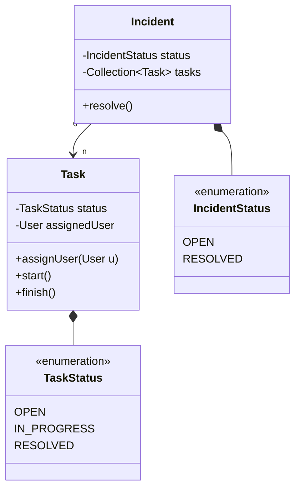

```mermaid
classDiagram
    class Incident {
        -IncidentStatus status
        -Collection~Task~ tasks     
        +resolve()
    }
    class Task{
        -TaskStatus status
        -User assignedUser
        +assignUser(User u)
        +start()
        +finish()
    }

    class IncidentStatus {
        <<enumeration>>
        OPEN
        RESOLVED
    }
    class TaskStatus {
        <<enumeration>>
        OPEN
        IN_PROGRESS
        RESOLVED
    }

    Incident "0" --> "n" Task
    Incident *-- IncidentStatus
    Task *-- TaskStatus
```
