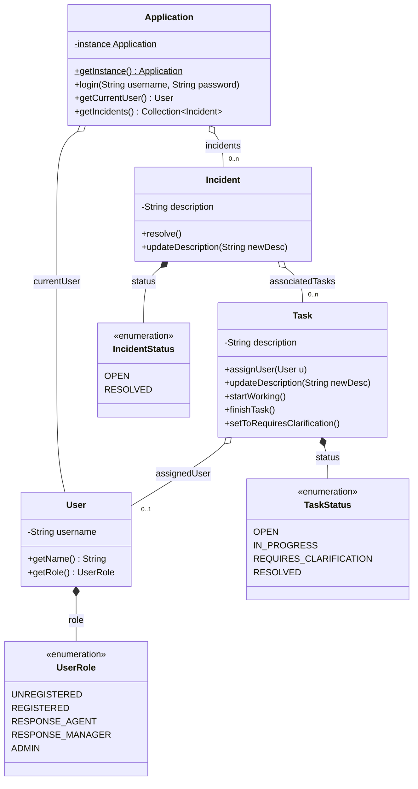

```mermaid
classDiagram
    class Application{
        +getInstance() Application$
        -instance Application$
        +login(String username, String password)
        +getCurrentUser() User
        +getIncidents() Collection~Incident~
    }
    class User{
        +getName() String
        +getRole() UserRole
        -String username
    }
    class UserRole{
        <<enumeration>>
        UNREGISTERED
        REGISTERED
        RESPONSE_AGENT
        RESPONSE_MANAGER
        ADMIN
    }

    Application o-- User : currentUser
    User *-- UserRole : role

    class Incident {
        -String description     
        +resolve()
        +updateDescription(String newDesc)
    }
    class Task{
        -String description
        +assignUser(User u)
        +updateDescription(String newDesc)
        +startWorking()
        +finishTask()
        +setToRequiresClarification()
    }

    class IncidentStatus {
        <<enumeration>>
        OPEN
        RESOLVED
    }
    class TaskStatus {
        <<enumeration>>
        OPEN
        IN_PROGRESS
        REQUIRES_CLARIFICATION
        RESOLVED
    }

    Incident o-- "0..n" Task : associatedTasks
    Incident *-- IncidentStatus : status
    Task *-- TaskStatus : status
    Task  o-- "0..1" User : assignedUser
    Application  o-- "0..n" Incident : incidents
```
